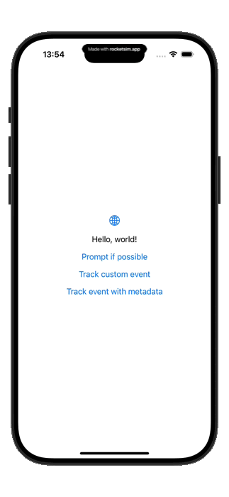

# TestimonialKit iOS SDK

<aside>
🚀 Boost your App Store ratings by smartly prompting your happiest users

</aside>

## Overview

TestimonialKit is an intelligent SDK that helps you collect feedback and increase your App Store ratings by identifying your most satisfied users and prompting them at the right moment.

[]()
[]()
[]()
[]()
[]()

<div style="display: flex; flex-wrap: wrap; gap: 12px;">
  
  
</div>

## Features

- Smart prompting based on user satisfaction levels
- Customizable prompt UI to match your app's design
- Multi-step flow: rating → comment → App Store review
- Complete event tracking system
- Detailed analytics dashboard
- Offline support with automatic request retrying
- Built-in logging system with configurable verbosity

## Installation

### Swift Package Manager

Add the following to your Package.swift file:

```swift
dependencies: [
    .package(url: "https://github.com/testimonialkit/ios-sdk.git", from: "1.0.0")
]

```

### CocoaPods

Add the following to your Podfile:

```ruby
pod 'TestimonialKit' // not implemented yet

```

## Requirements

- iOS 16.0+
- macOS 13.0+
- Swift 5.5+
- Xcode 13.0+

## Getting Started

### 1. Create an account

Before integrating TestimonialKit, create an account at [app.testimonialkit.dev](https://app.testimonialkit.dev) to obtain your API key.

### 2. Initialize the SDK

Add the following code to your AppDelegate or application startup:

```swift
import TestimonialKit

// In your AppDelegate or App initialization
func application(_ application: UIApplication, didFinishLaunchingWithOptions launchOptions: [UIApplication.LaunchOptionsKey: Any]?) -> Bool {
    // Initialize TestimonialKit with your API key
    TestimonialKit.setup(withKey: "YOUR_API_KEY")
    
    return true
}

```

### 3. Track user events

Track positive and negative events throughout your app to help TestimonialKit identify the right moment to prompt users:

```swift
// Track a positive event
TestimonialKit.trackEvent(
    name: "completed_purchase",
    score: 10,
    type: .positive,
    metadata: ["item_id": "123", "price": "9.99"]
)

// Track a negative event
TestimonialKit.trackEvent(
    name: "cancellation",
    score: -5,
    type: .negative,
    metadata: ["reason": "too_expensive"]
)

```

### 4. Prompt at the right moment

Call the `promptIfPossible` method when you think it might be a good time to show the feedback prompt (e.g., after a successful action, at the end of a session):

```swift
TestimonialKit.promptIfPossible { result in
    switch result {
    case .completed:
        print("User completed the feedback flow with a comment")
    case .completedWithoutComment:
        print("User submitted a rating without a comment")
    case .redirectedToStore:
        print("User was redirected to the App Store")
    case .storeReviewSkipped:
        print("User provided feedback but skipped App Store review")
    case .cancelled:
        print("User cancelled the feedback flow")
    }
}

```

TestimonialKit will automatically determine if the user should be prompted based on their event history and previous prompt interactions.

## Customization

You can customize the appearance and text of the prompts to match your app's design:

```swift
let customConfig = PromptConfig(
    ratingStrings: .init(
        title: "How would you rate our app?",
        subtitle: "Your feedback helps us improve!",
        starLabels: ["Terrible", "Bad", "Okay", "Good", "Amazing"]
    ),
    commentStrings: .init(
        title: "Tell us more",
        placeholder: "What do you like or dislike about our app?"
    ),
    tintColor: .blue,
    tintColorDark: .cyan
)

TestimonialKit.promptIfPossible(promptConfig: customConfig) { result in
    // Handle result
}

```

### Customizable Components

TestimonialKit provides extensive customization options for:

- Rating prompt (title, subtitle, star labels, button texts)
- Comment form (title, subtitle, placeholder, button texts)
- Store review prompt (title, message, button texts)
- Thank you screen (title, message, button text)
- Visual styling (colors, button shapes, text field appearance)

## Advanced Configuration

### Log Levels

Control the verbosity of TestimonialKit logs:

```swift
// Set log level during initialization
TestimonialKit.setup(withKey: "YOUR_API_KEY", logLevel: .verbose)

// Available log levels:
// .verbose - All logs
// .debug - Debug and higher
// .info - Info and higher (default)
// .warning - Warnings and errors only
// .error - Only errors
// .none - No logs

```

### Prompt Metadata

Include additional context when prompting users:

```swift
TestimonialKit.promptIfPossible(
    metadata: [
        "current_screen": "checkout_complete",
        "user_type": "premium"
    ],
    completion: { result in
        // Handle result
    }
)

```

## Architecture

TestimonialKit is built with a modern, resilient architecture:

- Leverages Swift Concurrency (async/await) for efficient background operations
- Uses the actor model for thread safety
- Implements a persistent request queue for offline support
- Provides robust error handling and automatic retries

## Best Practices

- Track meaningful events that indicate user satisfaction or frustration
- Use positive scores (1-10) for positive events and negative scores (-10 to -1) for negative events
- Call `promptIfPossible` at natural break points in your app flow
- Customize the prompt UI to match your app's design language
- Review analytics in the TestimonialKit dashboard to optimize your prompting strategy

## License

TestimonialKit is available under the MIT license. See the LICENSE file for more info.

## Support

For issues or feature requests, please visit our [GitHub issues page](https://github.com/testimonialkit/ios-sdk/issues) or contact support at `support@testimonialkit.dev`.

For full documentation, please visit [Documentation Page](https://testimonialkit.github.io/ios-sdk/).
